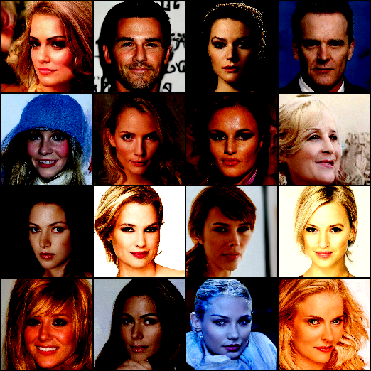

# GenerativeModels for Face generation
Training on CelebA-HQ images to generate faces
--- 

- [DDPM](ddpm) - implementation of original [DDPM](https://arxiv.org/abs/2006.11239) with minor things taken from [IDDPM](https://arxiv.org/abs/2102.09672)

- Result


- To train the model with specific config
```bash
CUDA_VISIBLE_DEVICES=0,1 torchrun \
    --standalone \
    --nproc_per_node=2 \
    -m ddpm.train_diffusion \
    --config ddpm/configs/config_2.yaml
```

Latent Diffusion
---
Under construction